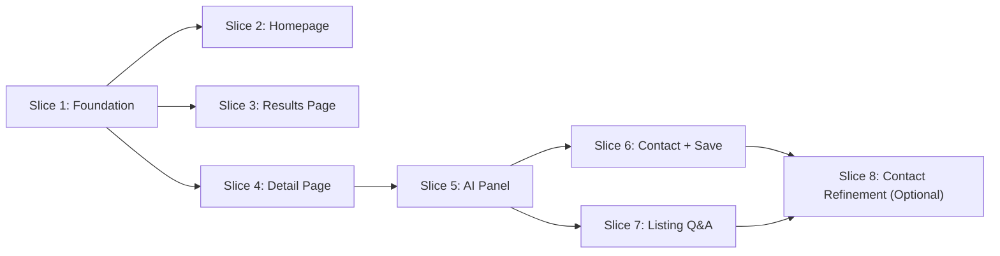

# Implementation Plan — eBay Vehicles Buyer Experience POC

> **Source PRD:** [ebay_vehicles_prd.md](ebay_vehicles_prd.md)

This plan breaks the PRD into 7 independently-grabbable vertical slices plus 1 optional follow-on slice. Each slice cuts end-to-end through data, server, and UI layers and is demoable on its own once complete. Slices are ordered by dependency — start from the top and work down.

---

## How to use this plan (for agents)

### Before you start

1. Read the PRD ([ebay_vehicles_prd.md](ebay_vehicles_prd.md)) for product context.
2. Pick a slice whose **Blocked by** dependencies are already satisfied (see Dependency Graph above).
3. Prefer slices whose **Status** is not **Done** yet. If every slice is Done, the POC is complete unless the PRD or this plan changes.

### After you finish work on a slice

Do this so the next agent does not repeat completed work and has context for follow-ups:

1. **Check off acceptance criteria** — In that slice only, change every `- [ ]` under **Acceptance criteria** to `- [x]` for items that are truly done. Leave unchecked items that still need work (or split follow-up work into a note in the Development log).
2. **Update slice status** — In the slice’s **Status** table row, set **Status** to `Done` when all acceptance criteria for that slice are checked.
3. **Append to [Development log](#development-log)** — Add one bullet under that slice’s subsection with:

- **Date** (ISO `YYYY-MM-DD`)
- **One short paragraph** (or 3–6 bullets) summarising what was implemented, key files or routes touched, and any caveats, env vars, or follow-ups for the next agent.

### If something is only partially done

- Leave the relevant acceptance checkboxes **unchecked**.
- Add a Development log entry under that slice with what’s done vs. what’s left.

### Do not

- Uncheck completed items without a deliberate reason (revert or scope change). If the plan text is wrong, update the acceptance criteria in a commit with a clear message.

---

## Dependency Graph



Slices 2, 3, and 4 can run **in parallel** after Slice 1 is complete. Slice 7 can begin after Slice 5 without waiting on Slice 6 if separate agents are available. Slice 8 is explicitly optional and must not be implemented without user approval.

Frontend/UI parallel work for Slices 5-8 should follow [docs/slice-5-7-frontend-spec.md](docs/slice-5-7-frontend-spec.md).

---

## Conventions

| Convention          | Detail                                                                                                                                             |
| ------------------- | -------------------------------------------------------------------------------------------------------------------------------------------------- |
| **UI Library**      | shadcn-svelte (bits-ui v2) — install via CLI, use as primary component libraryUse /shadcn-svelte skill                                             |
| **Custom UI**       | Only when shadcn-svelte doesn't cover it; prefer extending over building from scratch                                                              |
| **Design Skill**    | Apply the `/frontend-design` skill for visual direction — distinctive typography, color palette, spatial composition. Avoid generic AI aesthetics. |
| **Svelte**          | Svelte 5 runes mode (`$state`, `$derived`, `$effect`, `$props`) — enforced project-wide                                                            |
| **Styling**         | Tailwind CSS v4 via `@tailwindcss/vite` plugin                                                                                                     |
| **Data**            | Mock data with hardcoded values; no computation engines for badges or rankings                                                                     |
| **AI**              | OpenAI API, server-side only, cached per listing ID. Default model: `gpt-5.4-mini`                                                                 |
| **Package Manager** | pnpm                                                                                                                                               |
| **MCP**             | Use the Svelte MCP server (`list-sections`, `get-documentation`, `svelte-autofixer`) when writing Svelte code                                      |

---

## Environment

- Local secrets live in the repo-root `.env` file.
- Add `OPENAI_API_KEY` to `.env` for the AI confidence route.

---

## Parallel Ownership

- **Backend/API agent** owns `src/routes/api/`\*\*, `src/lib/types/confidence.ts`, and any minimal non-UI helpers for AI/data contracts.
- **Frontend/UX agent** owns the Svelte components and page wiring for the confidence panel, listing Q&A surface, and contact flow.
- Both agents should treat `src/lib/types/confidence.ts` as the shared contract boundary and avoid inventing new payload fields outside that file without coordination.

---

## Slice 1 — Foundation: Mock data, types, shadcn-svelte, layout shell

|                |                      |
| -------------- | -------------------- |
| **Blocked by** | Nothing — start here |
| **Status**     | Done                 |

### What to build

Establish the data contract, shared UI primitives, and app shell that every other slice depends on.

### Scope

- **shadcn-svelte setup:** Install via CLI. Add initial components: Badge, Button, Card, Input, Dialog, Skeleton, Separator, and any others needed as the base set.
- **TypeScript types** in `src/lib/types/`:
  - `Listing` — app-level vehicle listing shape: id, title, price, year, make, model, trim, mileage, condition, transmission, drivetrain, color, vin (masked), description, photos (URLs), location, sellerType (private/dealer)
  - `Seller` — username, feedbackScore, location, memberSince
  - `priceBadge`: `'below_market' | 'fair' | 'above_market'`
  - `mileageBadge`: `'low' | 'average' | 'high'`
  - `watcherCount`, `saveCount` — numbers
  - `marketAverage` — number, for price context display
- **Mock data** in `src/lib/api/mock.ts`:
  - 20 realistic listings with real makes/models/prices (public domain data)
  - Mix of private sellers (sparse 1–2 sentence descriptions) and dealers (detailed descriptions with service history)
  - Hardcoded `priceBadge`, `mileageBadge`, `watcherCount`, `saveCount` per listing
  - Deliberate scenario coverage should map to the 2 buyer personas:
    - **Needs-first buyer**: listings that support shortcut-chip journeys like "Reliable under $15k", "Low mileage sedans", "Family SUVs", "First car under $10k", and "Trucks under $20k"
    - **Model-specific buyer**: listings for buyers who already know the year/make/model/trim they want and are comparing detail, price fairness, mileage, and seller quality
  - Include enough variance inside each persona bucket for AI demo value: suspiciously cheap listing, salvage/rebuilt-title listing, premium-but-overpriced dealer listing, budget commuter, family SUV, truck, EV, and enthusiast car
  - Realistic photo URLs (use placeholder images or real stock photo URLs)
- **Data access layer** in `src/lib/api/index.ts`:
  - Exports mock-backed listing accessors used by loaders and server routes
- **Shared components** in `src/lib/components/`:
  - `ListingCard.svelte` — photo, year/make/model, price, mileage, location, condition, price badge, mileage badge, watcher count
  - `SignalBadge.svelte` — reusable badge component for price and mileage signals (Below Market / Fair / Above Market, Low / Average / High)
- **App layout** in `src/routes/+layout.svelte`:
  - Nav bar with logo/brand, responsive container
  - Clean, minimal chrome — content-first

### File map

```
src/lib/types/
  listing.ts              ← Listing, Seller, badge types
src/lib/api/
  mock.ts                 ← 40 mock listings
  index.ts                ← Exports mock-backed listing accessors
src/lib/components/
  ListingCard.svelte      ← Shared listing card
  SignalBadge.svelte      ← Shared badge component
src/routes/
  +layout.svelte          ← App shell with nav
```

### Acceptance criteria

- `pnpm dev` starts without errors
- shadcn-svelte components are installed and importable
- TypeScript types compile cleanly
- `mock.ts` exports 40 listings with varied data
- `ListingCard` renders a card with photo, details, and badges
- `SignalBadge` renders all 6 badge variants (3 price + 3 mileage)
- Layout shell renders nav + content slot on all breakpoints
- Data accessors return mock data consistently

### PRD requirements covered

None directly — this is scaffolding. All subsequent slices depend on it.

---

## Slice 2 — Homepage: Search bar + shortcut chips + trending listings

|                |         |
| -------------- | ------- |
| **Blocked by** | Slice 1 |
| **Status**     | Done    |

### What to build

The homepage as a destination — search bar for intent-driven buyers, shortcut chips for needs-first buyers, and trending listings for browsers.

### Scope

- `**SearchBar.svelte` in `src/lib/components/`:
  - Full-width text input, prominent placement
  - "Search Vehicles" CTA button
  - On submit, navigates to `/vehicles?q={query}`
- **Shortcut chips** below search bar:
  - 4–5 hardcoded need-based queries: "Reliable under $15k", "Low mileage sedans", "Family SUVs", "First car under $10k", "Trucks under $20k"
  - Tap to navigate to `/vehicles?q={chip text}`
- `**TrendingListings.svelte` in `src/lib/components/`:
  - Fetches listings sorted by `watcherCount + saveCount` (descending)
  - Renders as a horizontal row or grid of `ListingCard` components
  - Cards show watcher count as social proof ("47 watching")
- **Homepage** at `src/routes/+page.svelte`:
  - Composes SearchBar + chips + TrendingListings
  - Clean hierarchy: search > chips > trending
  - Homepage should feel like a destination, not just a search box

### File map

```
src/lib/components/
  SearchBar.svelte           ← Search input + shortcut chips
  TrendingListings.svelte    ← Trending row sorted by social proof
src/routes/
  +page.svelte               ← Homepage composition
  +page.server.ts            ← Load trending listings from mock data
```

### Acceptance criteria

- Search bar is the primary, prominent element on the homepage
- Typing a query and pressing Search navigates to `/vehicles?q=...`
- Shortcut chips are visible below the search bar
- Tapping a chip navigates to `/vehicles?q={chip text}`
- Trending listings row renders below shortcuts, sorted by watcher + save count
- Listing cards in trending row show watcher count
- Homepage is responsive: mobile (375px+), tablet (768px+), desktop (1280px+)

### PRD requirements covered

VS-01, VS-02, VS-03, VS-04, VS-05, VS-06

---

## Slice 3 — Results Page: Listing grid + badges + filters + sort

|                |         |
| -------------- | ------- |
| **Blocked by** | Slice 1 |
| **Status**     | Done    |

### What to build

The evaluation stage — a results page where price and mileage badges enable quick triage, and filters narrow results without page reloads.

### Scope

- **Results page** at `/vehicles`:
  - Receives `?q=` query param from search/chips
  - Server load function filters mock data by query
  - Renders grid of `ListingCard` components with price + mileage badges
- **Filter panel**:
  - Price range, mileage range, condition (new/used/salvage), seller type (private/dealer)
  - Sidebar on desktop, bottom sheet or collapsible on mobile
  - Filter changes update results without full page reload (client-side filtering or URL param updates)
- **Sort**:
  - Best Match, Price Low–High, Price High–Low, Mileage, Newest
  - Dropdown or toggle group
  - In mock mode, define **Best Match** explicitly as: query relevance first, then `priceBadge` preference (`below_market` > `fair` > `above_market`), then watcherCount + saveCount as a tiebreaker
- **Empty state**:
  - Graceful message with suggested actions (broaden search, try a shortcut chip)
- **Pagination**:
  - Max 20 listings per page, simple pagination controls
- **Query semantics**:
  - `?q=` is always preserved in the URL
  - Shortcut chips may start as plain text queries, but if a chip implies structure (for example "Reliable under $15k"), map it into URL-backed filters as part of the results-page implementation so the behavior is deterministic and testable

### File map

```
src/routes/vehicles/
  +page.svelte              ← Results grid + filters + sort
  +page.server.ts           ← Load: filter/sort mock data by query params
```

### Acceptance criteria

- Navigating to `/vehicles?q=Honda` shows filtered results
- Each listing card shows photo, year/make/model, price, mileage, location, condition
- Price badge (Below Market / Fair / Above Market) visible on every card
- Mileage badge (Low / Average / High) visible on every card
- Filter panel works: changing filters updates results without full page reload
- Sort dropdown changes result order
- Empty state renders when no results match
- Results paginate at 20 per page
- Responsive: sidebar filters on desktop, collapsed/bottom sheet on mobile

### PRD requirements covered

RP-01, RP-02, RP-03, RP-04, RP-05, RP-06, RP-07

---

## Slice 4 — Vehicle Detail Page: Gallery + specs + sticky panel

|                |         |
| -------------- | ------- |
| **Blocked by** | Slice 1 |
| **Status**     | Done    |

### What to build

The listing detail page — photo gallery, structured specs, seller info, and a sticky summary panel that makes the AI Confidence Panel discoverable at all times.

### Scope

- **Detail page** at `/vehicles/[id]`:
  - Server load fetches single listing by ID from mock data
  - 404 handling for invalid IDs
- **Photo gallery**:
  - Swipe on mobile, keyboard nav (arrow keys) on desktop
  - Thumbnail strip or dot indicators
- **Spec table**:
  - Structured table (not prose): year, make, model, trim, mileage, condition, transmission, drivetrain, color, VIN (masked)
- **Seller info block**:
  - Username, feedback score, location, member since
- **Price in market context**:
  - "$X below/above market average for this year/make/model/trim"
- `**StickyPanel.svelte`:
  - Fixed bar (bottom on mobile, sidebar or top on desktop)
  - Shows: price verdict badge, mileage context, one-line AI teaser
  - "See full analysis" CTA button — scrolls to or expands the AI Confidence Panel (wired in Slice 5)
- **URL-shareable**: all state from route params, not session

### File map

```
src/routes/vehicles/[id]/
  +page.svelte              ← Detail page: gallery, specs, seller, sticky panel
  +page.server.ts           ← Load: fetch single listing by ID
src/lib/components/
  StickyPanel.svelte        ← Persistent summary bar
```

### Acceptance criteria

- Navigating to `/vehicles/[id]` renders the full detail page
- Photo gallery supports swipe (mobile) and keyboard nav (desktop)
- Spec table renders all vehicle fields in structured format
- Seller info block shows username, feedback score, location, member since
- Price is shown with market context ("$2,100 below market average")
- Sticky panel is visible on page load without scrolling
- Sticky panel shows price verdict, mileage context, and "See full analysis" CTA
- Page is shareable via URL
- Invalid ID returns a 404 or graceful error
- Responsive across all breakpoints

### PRD requirements covered

VD-01, VD-02, VD-03, VD-04, VD-05, VD-06

---

## Slice 5 — AI Confidence Panel: OpenAI API + server-side caching

|                |             |
| -------------- | ----------- |
| **Blocked by** | Slice 4     |
| **Status**     | Not started |

### What to build

The centrepiece — an expandable AI panel on the detail page that synthesises known issues, price verdict, and seller questions. On the first uncached request it should generate and stream the analysis so the POC feels responsive, then cache the completed result for later opens in the same running app instance.

### Scope

- **Shared contracts** in `src/lib/types/confidence.ts`:
  - `ConfidencePayload` for the normalized AI response
  - `ConfidenceChatMessage`, `ConfidenceChatRequest`, and `ConfidenceChatResponse` for the follow-up Q&A flow
  - `ContactDraftContext` for future seller-message generation
  - `AIError` for structured route failures
- **Server route** at `/api/confidence/[id]/+server.ts`:
  - GET handler that accepts a listing ID
  - Fetches listing data from mock API
  - Accepts the current search query as optional input (for example `?q=` carried from the results page) so the analysis can emphasize what the buyer likely cares about while still covering general due diligence
  - Assembles structured prompt from listing fields (year, make, model, trim, mileage, condition, price, marketAverage, description, sellerType) plus the user search query when present
  - Calls the OpenAI API using `gpt-5.4-mini` by default (server-side only — `OPENAI_API_KEY` env var)
  - Streams the first uncached response to the client, then caches the completed result in-memory by cache key
  - Cache key must include listing ID, normalized `q`, prompt version, and model version so prompt changes do not silently reuse stale output
  - Returns cached response on subsequent requests instantly within the same running app instance
  - Returns JSON with an explicit contract:
    - success shape:
      - `ok: true`
      - `cacheHit: boolean`
      - `listing`: minimal listing summary for UI context
      - `analysis`: `ConfidencePayload`
    - error shape:
      - `ok: false`
      - `error.code`: one of `missing_api_key`, `invalid_request`, `listing_not_found`, `generation_failed`, `invalid_model_response`
      - `error.message`: user-safe message
  - Graceful error handling: returns structured error, never exposes API key or raw error
- `**ConfidencePanel.svelte` in `src/lib/components/`:
  - Expandable panel on the detail page, triggered by "See full analysis" CTA in StickyPanel
  - On expand: fetches `/api/confidence/[id]`, including the current `q` value when available
  - **Section 1 — Known Issues**: reliability concerns for this year/make/model/trim. Includes disclaimer: "AI-generated analysis — not a vehicle inspection."
  - **Section 2 — Price Verdict**: Below Market / Fair / Above Market with 2–3 sentences of reasoning
  - **Section 3 — Questions to Ask the Seller**: 4–6 specific questions derived from listing data
  - Streaming-first render on first open, with loading skeleton only before the first chunk arrives
  - Instant render when cached (no loading state)
  - Optional buyer-intent subhead when a search query is present, such as "Focused on reliability under $15k"
  - Error state: friendly message, no broken UI
- **Prompt engineering**: the prompt must produce consistently useful output across listings with varied data quality (sparse private seller vs. detailed dealer)
  - The prompt should balance user intent against general due diligence: prioritize what the user searched for without ignoring title status, maintenance risk, pricing, and seller transparency

### File map

```
src/routes/api/confidence/[id]/
  +server.ts                ← OpenAI API call + cache
src/lib/components/
  ConfidencePanel.svelte    ← Expandable 3-section AI panel
src/lib/types/
  confidence.ts             ← Shared confidence/chat/contact contracts
```

### Acceptance criteria

- Expanding the panel on the detail page triggers a fetch to `/api/confidence/[id]`
- API call is server-side only — `OPENAI_API_KEY` never in client bundle or network tab
- On the first uncached open, the panel begins rendering via streaming once content starts arriving
- Loading skeleton shows only until the first streamed content arrives
- Panel renders 3 sections in order: Known Issues → Price Verdict → Questions to Ask
- Known Issues section includes AI disclaimer
- Price verdict shows one of three verdicts with plain-language reasoning
- Seller questions are specific to the listing (not generic boilerplate) — verifiable by comparing 2–3 different listings
- When `q` is present, the analysis reflects that user intent in a visible but lightweight way
- Second open of the same listing returns instantly within the same running app instance (cached, no loading state)
- API error produces a graceful fallback, not a broken UI
- Panel is responsive across all breakpoints

### PRD requirements covered

AI-01, AI-02, AI-03, AI-04, AI-05, AI-06, AI-07, AI-08, AI-09

---

## Slice 6 — Contact Seller Modal + Session Save

|                |             |
| -------------- | ----------- |
| **Blocked by** | Slice 5     |
| **Status**     | Not started |

### What to build

The bridge from analysis to action — a contact modal with AI-generated questions pre-populated, and a lightweight session save.

### Scope

- `**ContactModal.svelte` in `src/lib/components/`:
  - Triggered by "Contact Seller" CTA on the detail page
  - Receives the seller questions from AI panel Section 3
  - Pre-populates the message body with those questions
  - Uses shadcn-svelte Dialog component
  - Sticky CTA on mobile (fixed bottom bar alongside or within StickyPanel)
- **Session save**:
  - Save button on the detail page (heart icon or similar)
  - Stores listing ID in a Svelte `$state` store (module-level, shared across pages within session)
  - Cleared on page refresh — no localStorage, no persistence
  - Visual indicator when a listing is saved (filled icon)
- **State flow**: AI panel questions → passed as prop or store → ContactModal reads them on open
- **Fallback behavior**:
  - If AI questions are unavailable because analysis has not run yet or the request failed, the modal still opens with a sensible default template and a CTA to generate or retry AI questions

### File map

```
src/lib/components/
  ContactModal.svelte       ← Pre-populated seller questions modal
src/lib/stores/
  saved.ts                  ← Session-only saved listings store ($state)
```

### Acceptance criteria

- "Contact Seller" CTA opens a modal
- Modal message body is pre-populated with the AI-generated seller questions from panel Section 3
- If AI content is unavailable, the modal falls back to a default contact template instead of blocking the user
- Save button toggles saved state visually (e.g. filled/unfilled icon)
- Saved state persists across page navigation within the session
- Saved state clears on page refresh
- Contact CTA is sticky on mobile
- Modal is responsive and accessible (keyboard navigable, focus trap)

### PRD requirements covered

SV-01, SV-02

---

## Slice 7 — Listing Q&A: Follow-up questions in a dedicated drawer surface

|                |             |
| -------------- | ----------- |
| **Blocked by** | Slice 5     |
| **Status**     | Not started |

### What to build

Add a lightweight, listing-grounded follow-up Q&A experience in a dedicated drawer or sheet that opens from the AI Confidence Panel. The structured assessment remains the first thing the buyer sees in the main page flow; chat is the adjacent "go deeper" layer for follow-up questions such as red flags, maintenance risk, fit for a use case, or clarification on seller questions.

### Scope

- **Route contract** at `/api/confidence-chat/[id]/+server.ts`:
  - POST handler that accepts a listing ID and a chat payload
  - Request shape:
    - `listingId`
    - optional `query`
    - `messages` array containing recent chat turns
  - Response shape:
    - `ok: true`
    - `cacheHit: boolean`
    - `listingId`
    - `message` containing the assistant reply
    - optional `suggestedPrompts` for the next turn
  - The route may reuse the confidence cache or confidence payload as input, but it must stay stateless with respect to session history
- **UX integration**:
  - Keep the structured AI Confidence Panel in the main detail page flow as the primary read-only research artifact
  - Add an "Ask about this listing" entry point at the bottom of the assessment that opens a dedicated drawer on desktop and full-screen sheet on mobile
  - Include 3–4 starter prompts such as:
    - "What are the biggest red flags here?"
    - "What should I confirm with the seller?"
    - "Is this price justified?"
    - "Would you trust this as a daily driver?"
- **Chat behavior**:
  - Session-only conversation history per listing
  - Ground responses in:
    - the listing data
    - the Slice 5 confidence output when available
    - the buyer's original search query when available
  - Position the feature as listing guidance, not general car advice or a chatbot
  - Clear disclaimer that AI guidance is not a vehicle inspection or professional mechanic review
  - Closing the drawer preserves the current listing's chat history for the session
- **Server route**:
  - Add a server-only route for listing-grounded Q&A
  - Accepts listing id, user message, and recent thread context
  - Uses the same core listing facts and confidence context as Slice 5 so there is one intelligence foundation rather than duplicate prompt systems
  - Returns concise, grounded answers and optional suggested next questions
- **State flow**:
  - Assessment state and chat state remain independent
  - Chat opens in a separate drawer surface, but remains logically connected to the same listing and assessment context
  - Chat context may later be consumed by the contact flow, but seller questions must not depend on chat to function

### File map

```
src/routes/api/confidence-chat/[id]/
  +server.ts                ← Listing-grounded follow-up Q&A route
src/lib/components/
  ConfidencePanel.svelte    ← Assessment surface with chat entry point
  ConfidenceDrawer.svelte   ← Drawer or mobile sheet for follow-up Q&A
src/lib/types/
  confidence.ts             ← Shared confidence + Q&A payload types
```

### Acceptance criteria

- The AI Confidence Panel still opens with the structured 3-section assessment first
- The confidence panel includes an "Ask about this listing" trigger that opens a dedicated Q&A drawer or sheet
- Buyers can ask at least one follow-up question and receive a listing-grounded response
- Starter prompts are available to reduce blank-state friction
- Responses are clearly grounded in the listing and assessment context, not generic automotive advice
- Conversation history persists while the user remains in the current session for that listing
- The Q&A experience is responsive and does not break the assessment layout on mobile or desktop
- If the Q&A request fails, the assessment remains usable and the chat area shows a graceful retry state

### Product rules

- Assessment and follow-up Q&A are one connected trust-building experience, but not one scroll container
- Seller contact remains a separate action flow
- Chat may improve seller-question generation later, but must not be required for due-diligence questions to exist

---

## Slice 8 — Contact Refinement From AI Context _(Optional — ask user before implementation)_

|                |                                    |
| -------------- | ---------------------------------- |
| **Blocked by** | Slices 6 and 7                     |
| **Status**     | Optional — do not start unapproved |

### What to build

Enhance the Contact Seller flow so the pre-populated outreach can incorporate not just the structured assessment, but also the buyer's expressed concerns from the embedded listing Q&A session. This is an optimization layer on top of Slice 6, not a required dependency for the base contact experience.

### Scope

- **Refinement only**:
  - Contact Seller continues to work from listing data + Slice 5 assessment even if no chat occurred
  - When chat context exists, the modal can incorporate the buyer's stated concerns into the generated seller questions or draft message
- **Question-generation hierarchy**:
  - Base due-diligence questions from listing facts and risk heuristics
  - Refine with Slice 5 assessment outputs
  - Optionally refine further with relevant buyer concerns from Slice 7 chat
  - Produce a concise, seller-ready draft the buyer can edit before sending
- **Guardrails**:
  - Never let chat override core buyer-protection questions
  - Keep the generated outreach focused on the buyer's best interests, not on making the seller conversation sound clever
  - Maintain a visible separation between research UI and contact UI

### Acceptance criteria

- Contact Seller still works when no AI chat has occurred
- When chat context exists, the generated seller questions or draft message can reflect the buyer's stated concerns
- Core due-diligence questions remain present even if the buyer chat was narrow or low quality
- The user can review and edit the generated seller message before sending
- This slice is implemented only after explicit user approval

### Product rules

- This slice is optional
- Do not begin implementation unless the user explicitly asks for it

---

## Development log

Agents append entries here when a slice is completed or partially completed. Newest entries at the **top** of each slice subsection (so the latest work is easy to find).

### Slice 1 — Foundation

- **2026-04-04** — Slice 1 complete. Node upgraded to v22 (required by shadcn-svelte CLI). shadcn-svelte v1.2.7 installed via CLI (Badge, Button, Card, Input, Dialog, Skeleton, Separator into `src/lib/components/ui/`); `tailwind-merge`, `clsx`, `lucide-svelte` added as deps; `$lib/utils.ts` created with `cn()` and shadcn type helpers. Design system in `src/routes/layout.css`: warm amber OKLCH palette, Fraunces + Outfit fonts, signal color tokens. Types in `src/lib/types/listing.ts`. 20 realistic mock listings in `src/lib/api/mock.ts` (mix of private/dealer, varied conditions). Data access layer in `src/lib/api/index.ts` returns mock listings. `ListingCard.svelte` and `SignalBadge.svelte` built. Nav shell in `+layout.svelte`. Homepage placeholder at `+page.svelte` renders badge smoke test + 3 listing cards. `pnpm check` passes with 0 errors. Dev server runs at `:5175`. Caveat: picsum placeholder images only.

### Slice 2 — Homepage

- **2026-04-04** — Slice 2 complete. Design refresh applied: Shop-app-inspired layout with eBay blue (`#0968F6` / `oklch(52% 0.24 264)`) as primary accent, replacing the original sage green. `SearchBar.svelte` redesigned as a pill-shaped input with circular blue arrow button (Shop-style). `+page.svelte` hero section made airier with generous spacing, staggered chip entrance animations, and fluid typography via `clamp()`. `TrendingListings.svelte` upgraded with "View all →" link, subtitle, and staggered card entrance animations. `ListingCard.svelte` refined with surface background, inner padding, blue-tinted hover shadows, and image error fallback. `+layout.svelte` header modernised: border removed in favour of blur-only, pill-shaped nav links, eBay-colored multi-character wordmark (red/blue/yellow/green cycling). Color palette in `layout.css` fully reworked: all neutrals tinted toward blue (hue 258), `--color-primary-hover` added. `+page.server.ts` loads top 8 trending listings sorted by `watcherCount + saveCount`. `pnpm check` passes with 0 errors / 0 warnings. All 7 acceptance criteria met.

### Slice 3 — Results page

- **2026-04-04** — Slice 3 complete. Added `src/routes/vehicles/+page.server.ts` with URL-backed query parsing, deterministic chip-to-filter semantics, filtering, best-match sorting with query relevance, and pagination. Built `src/routes/vehicles/+page.svelte` with responsive sidebar/mobile filters, sort controls, empty state, and results grid. Updated `SearchBar.svelte` so the input stays in sync with route data on same-route navigation, and refined `ListingCard.svelte` to surface listing condition in result cards. Verified with `svelte-check` at 0 errors / 0 warnings.

### Slice 4 — Vehicle detail page

- **2026-04-04** — Slice 4 complete. Added `src/routes/vehicles/[id]/+page.server.ts` and `src/routes/vehicles/[id]/+page.svelte` for the shareable listing detail route with 404 handling, gallery, thumbnails, specs, seller block, market-context pricing, and persistent summary CTA. Built `src/lib/components/StickyPanel.svelte` for desktop sticky and mobile bottom-bar variants. Follow-up patch finished keyboard navigation, touch swipe support, and cleanup needed for a warning-free Svelte build. Verified with `svelte-check` at 0 errors / 0 warnings.

### Slice 5 — AI Confidence Panel

_(No entries yet.)_

### Slice 6 — Contact + Save

_(No entries yet.)_

### Slice 7 — Listing Q&A

_(No entries yet.)_

### Slice 8 — Contact Refinement (Optional)

_(No entries yet.)_

**Example entry format (delete this block when the first real entry exists):**

```markdown
- **2026-04-03** — Summary: shadcn-svelte init, `listing.ts` + 40 mock listings, `ListingCard` + `SignalBadge`, nav shell in `+layout.svelte`. Files: `src/lib/api/mock.ts`, `src/lib/components/ListingCard.svelte`. Caveat: placeholder images only.
```
