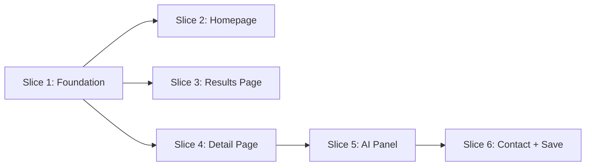

# Implementation Plan — eBay Vehicles Buyer Experience POC

> **Source PRD:** [ebay_vehicles_prd.md](ebay_vehicles_prd.md)

This plan breaks the PRD into 6 independently-grabbable vertical slices. Each slice cuts end-to-end through data, server, and UI layers and is demoable on its own once complete. Slices are ordered by dependency — start from the top and work down.

---

## How to use this plan (for agents)

### Before you start

1. Read the PRD ([ebay_vehicles_prd.md](ebay_vehicles_prd.md)) for product context.
2. Pick a slice whose **Blocked by** dependencies are already satisfied (see Dependency Graph above).
3. Prefer slices whose **Status** is not **Done** yet. If every slice is Done, the POC is complete unless the PRD or this plan changes.

### After you finish work on a slice

Do this so the next agent does not repeat completed work and has context for follow-ups:

1. **Check off acceptance criteria** — In that slice only, change every `- [ ]` under **Acceptance criteria** to `- [x]` for items that are truly done. Leave unchecked items that still need work (or split follow-up work into a note in the Development log).
2. **Update slice status** — In the slice’s **Status** table row, set **Status** to `Done` when all acceptance criteria for that slice are checked.
3. **Append to [Development log](#development-log)** — Add one bullet under that slice’s subsection with:

- **Date** (ISO `YYYY-MM-DD`)
- **One short paragraph** (or 3–6 bullets) summarising what was implemented, key files or routes touched, and any caveats, env vars, or follow-ups for the next agent.

### If something is only partially done

- Leave the relevant acceptance checkboxes **unchecked**.
- Add a Development log entry under that slice with what’s done vs. what’s left.

### Do not

- Uncheck completed items without a deliberate reason (revert or scope change). If the plan text is wrong, update the acceptance criteria in a commit with a clear message.

---

## Dependency Graph



Slices 2, 3, and 4 can run **in parallel** after Slice 1 is complete.

---

## Conventions

| Convention          | Detail                                                                                                                                             |
| ------------------- | -------------------------------------------------------------------------------------------------------------------------------------------------- |
| **UI Library**      | shadcn-svelte (bits-ui v2) — install via CLI, use as primary component libraryUse /shadcn-svelte skill                                             |
| **Custom UI**       | Only when shadcn-svelte doesn't cover it; prefer extending over building from scratch                                                              |
| **Design Skill**    | Apply the `/frontend-design` skill for visual direction — distinctive typography, color palette, spatial composition. Avoid generic AI aesthetics. |
| **Svelte**          | Svelte 5 runes mode (`$state`, `$derived`, `$effect`, `$props`) — enforced project-wide                                                            |
| **Styling**         | Tailwind CSS v4 via `@tailwindcss/vite` plugin                                                                                                     |
| **Data**            | Mock data with hardcoded values; no computation engines for badges or rankings                                                                     |
| **AI**              | Claude API, server-side only, cached per listing ID                                                                                                |
| **Package Manager** | pnpm                                                                                                                                               |
| **MCP**             | Use the Svelte MCP server (`list-sections`, `get-documentation`, `svelte-autofixer`) when writing Svelte code                                      |

---

## Slice 1 — Foundation: Mock data, types, shadcn-svelte, layout shell

|                |                      |
| -------------- | -------------------- |
| **Blocked by** | Nothing — start here |
| **Status**     | Done                 |

### What to build

Establish the data contract, shared UI primitives, and app shell that every other slice depends on.

### Scope

- **shadcn-svelte setup:** Install via CLI. Add initial components: Badge, Button, Card, Input, Dialog, Skeleton, Separator, and any others needed as the base set.
- **TypeScript types** in `src/lib/types/`:
  - `Listing` — mirrors eBay Browse API shape: id, title, price, year, make, model, trim, mileage, condition, transmission, drivetrain, color, vin (masked), description, photos (URLs), location, sellerType (private/dealer)
  - `Seller` — username, feedbackScore, location, memberSince
  - `priceBadge`: `'below_market' | 'fair' | 'above_market'`
  - `mileageBadge`: `'low' | 'average' | 'high'`
  - `watcherCount`, `saveCount` — numbers
  - `marketAverage` — number, for price context display
- **Mock data** in `src/lib/api/mock.ts`:
  - 20 realistic listings with real makes/models/prices (public domain data)
  - Mix of private sellers (sparse 1–2 sentence descriptions) and dealers (detailed descriptions with service history)
  - Hardcoded `priceBadge`, `mileageBadge`, `watcherCount`, `saveCount` per listing
  - 2–3 deliberately distinct listings for AI demo variance: one high mileage, one suspiciously cheap, one with condition "Good" and no explanation
  - Realistic photo URLs (use placeholder images or real stock photo URLs)
- **API toggle** in `src/lib/api/index.ts`:
  - Exports functions that switch between `mock.ts` and `ebay.ts` (stubbed) based on `USE_MOCK_API` env var
- **Shared components** in `src/lib/components/`:
  - `ListingCard.svelte` — photo, year/make/model, price, mileage, location, condition, price badge, mileage badge, watcher count
  - `SignalBadge.svelte` — reusable badge component for price and mileage signals (Below Market / Fair / Above Market, Low / Average / High)
- **App layout** in `src/routes/+layout.svelte`:
  - Nav bar with logo/brand, responsive container
  - Clean, minimal chrome — content-first

### File map

```
src/lib/types/
  listing.ts              ← Listing, Seller, badge types
src/lib/api/
  mock.ts                 ← 20 mock listings
  ebay.ts                 ← Stubbed eBay API client (same response shape)
  index.ts                ← Exports active client based on USE_MOCK_API
src/lib/components/
  ListingCard.svelte      ← Shared listing card
  SignalBadge.svelte      ← Shared badge component
src/routes/
  +layout.svelte          ← App shell with nav
```

### Acceptance criteria

- [x] `pnpm dev` starts without errors
- [x] shadcn-svelte components are installed and importable
- [x] TypeScript types compile cleanly
- [x] `mock.ts` exports 20 listings with varied data
- [x] `ListingCard` renders a card with photo, details, and badges
- [x] `SignalBadge` renders all 6 badge variants (3 price + 3 mileage)
- [x] Layout shell renders nav + content slot on all breakpoints
- [x] API toggle returns mock data when `USE_MOCK_API=true`

### PRD requirements covered

None directly — this is scaffolding. All subsequent slices depend on it.

---

## Slice 2 — Homepage: Search bar + shortcut chips + trending listings

|                |             |
| -------------- | ----------- |
| **Blocked by** | Slice 1     |
| **Status**     | Not started |

### What to build

The homepage as a destination — search bar for intent-driven buyers, shortcut chips for needs-first buyers, and trending listings for browsers.

### Scope

- `**SearchBar.svelte`\*\* in `src/lib/components/`:
  - Full-width text input, prominent placement
  - "Search Vehicles" CTA button
  - On submit, navigates to `/vehicles?q={query}`
- **Shortcut chips** below search bar:
  - 4–5 hardcoded need-based queries: "Reliable under $15k", "Low mileage sedans", "Family SUVs", "First car under $10k", "Trucks under $20k"
  - Tap to navigate to `/vehicles?q={chip text}`
- `**TrendingListings.svelte`\*\* in `src/lib/components/`:
  - Fetches listings sorted by `watcherCount + saveCount` (descending)
  - Renders as a horizontal row or grid of `ListingCard` components
  - Cards show watcher count as social proof ("47 watching")
- **Homepage** at `src/routes/+page.svelte`:
  - Composes SearchBar + chips + TrendingListings
  - Clean hierarchy: search > chips > trending
  - Homepage should feel like a destination, not just a search box

### File map

```
src/lib/components/
  SearchBar.svelte           ← Search input + shortcut chips
  TrendingListings.svelte    ← Trending row sorted by social proof
src/routes/
  +page.svelte               ← Homepage composition
  +page.server.ts            ← Load trending listings from mock data
```

### Acceptance criteria

- Search bar is the primary, prominent element on the homepage
- Typing a query and pressing Search navigates to `/vehicles?q=...`
- Shortcut chips are visible below the search bar
- Tapping a chip navigates to `/vehicles?q={chip text}`
- Trending listings row renders below shortcuts, sorted by watcher + save count
- Listing cards in trending row show watcher count
- Homepage is responsive: mobile (375px+), tablet (768px+), desktop (1280px+)

### PRD requirements covered

VS-01, VS-02, VS-03, VS-04, VS-05, VS-06

---

## Slice 3 — Results Page: Listing grid + badges + filters + sort

|                |             |
| -------------- | ----------- |
| **Blocked by** | Slice 1     |
| **Status**     | Not started |

### What to build

The evaluation stage — a results page where price and mileage badges enable quick triage, and filters narrow results without page reloads.

### Scope

- **Results page** at `/vehicles`:
  - Receives `?q=` query param from search/chips
  - Server load function filters mock data by query
  - Renders grid of `ListingCard` components with price + mileage badges
- **Filter panel**:
  - Price range, mileage range, condition (new/used/salvage), seller type (private/dealer)
  - Sidebar on desktop, bottom sheet or collapsible on mobile
  - Filter changes update results without full page reload (client-side filtering or URL param updates)
- **Sort**:
  - Best Match, Price Low–High, Price High–Low, Mileage, Newest
  - Dropdown or toggle group
- **Empty state**:
  - Graceful message with suggested actions (broaden search, try a shortcut chip)
- **Pagination**:
  - Max 20 listings per page, simple pagination controls

### File map

```
src/routes/vehicles/
  +page.svelte              ← Results grid + filters + sort
  +page.server.ts           ← Load: filter/sort mock data by query params
```

### Acceptance criteria

- Navigating to `/vehicles?q=Honda` shows filtered results
- Each listing card shows photo, year/make/model, price, mileage, location, condition
- Price badge (Below Market / Fair / Above Market) visible on every card
- Mileage badge (Low / Average / High) visible on every card
- Filter panel works: changing filters updates results without full page reload
- Sort dropdown changes result order
- Empty state renders when no results match
- Results paginate at 20 per page
- Responsive: sidebar filters on desktop, collapsed/bottom sheet on mobile

### PRD requirements covered

RP-01, RP-02, RP-03, RP-04, RP-05, RP-06, RP-07

---

## Slice 4 — Vehicle Detail Page: Gallery + specs + sticky panel

|                |             |
| -------------- | ----------- |
| **Blocked by** | Slice 1     |
| **Status**     | Not started |

### What to build

The listing detail page — photo gallery, structured specs, seller info, and a sticky summary panel that makes the AI Confidence Panel discoverable at all times.

### Scope

- **Detail page** at `/vehicles/[id]`:
  - Server load fetches single listing by ID from mock data
  - 404 handling for invalid IDs
- **Photo gallery**:
  - Swipe on mobile, keyboard nav (arrow keys) on desktop
  - Thumbnail strip or dot indicators
- **Spec table**:
  - Structured table (not prose): year, make, model, trim, mileage, condition, transmission, drivetrain, color, VIN (masked)
- **Seller info block**:
  - Username, feedback score, location, member since
- **Price in market context**:
  - "$X below/above market average for this year/make/model/trim"
- `**StickyPanel.svelte`\*\*:
  - Fixed bar (bottom on mobile, sidebar or top on desktop)
  - Shows: price verdict badge, mileage context, one-line AI teaser
  - "See full analysis" CTA button — scrolls to or expands the AI Confidence Panel (wired in Slice 5)
- **URL-shareable**: all state from route params, not session

### File map

```
src/routes/vehicles/[id]/
  +page.svelte              ← Detail page: gallery, specs, seller, sticky panel
  +page.server.ts           ← Load: fetch single listing by ID
src/lib/components/
  StickyPanel.svelte        ← Persistent summary bar
```

### Acceptance criteria

- Navigating to `/vehicles/[id]` renders the full detail page
- Photo gallery supports swipe (mobile) and keyboard nav (desktop)
- Spec table renders all vehicle fields in structured format
- Seller info block shows username, feedback score, location, member since
- Price is shown with market context ("$2,100 below market average")
- Sticky panel is visible on page load without scrolling
- Sticky panel shows price verdict, mileage context, and "See full analysis" CTA
- Page is shareable via URL
- Invalid ID returns a 404 or graceful error
- Responsive across all breakpoints

### PRD requirements covered

VD-01, VD-02, VD-03, VD-04, VD-05, VD-06

---

## Slice 5 — AI Confidence Panel: Claude API + server-side caching

|                |             |
| -------------- | ----------- |
| **Blocked by** | Slice 4     |
| **Status**     | Not started |

### What to build

The centrepiece — an expandable AI panel on the detail page that synthesises known issues, price verdict, and seller questions. Cached per listing so every buyer after the first gets instant results.

### Scope

- **Server route** at `/api/confidence/[id]/+server.ts`:
  - GET handler that accepts a listing ID
  - Fetches listing data from mock API
  - Assembles structured prompt from listing fields (year, make, model, trim, mileage, condition, price, marketAverage, description, sellerType)
  - Calls Claude API (Anthropic SDK, server-side only — `ANTHROPIC_API_KEY` env var)
  - Caches response in-memory by listing ID (Map or similar); returns cached response on subsequent requests instantly
  - Returns JSON with three sections: `knownIssues`, `priceVerdict`, `questionsToAsk`
  - Graceful error handling: returns structured error, never exposes API key or raw error
- `**ConfidencePanel.svelte`\*\* in `src/lib/components/`:
  - Expandable panel on the detail page, triggered by "See full analysis" CTA in StickyPanel
  - On expand: fetches `/api/confidence/[id]`
  - **Section 1 — Known Issues**: reliability concerns for this year/make/model/trim. Includes disclaimer: "AI-generated analysis — not a vehicle inspection."
  - **Section 2 — Price Verdict**: Below Market / Fair / Above Market with 2–3 sentences of reasoning
  - **Section 3 — Questions to Ask the Seller**: 4–6 specific questions derived from listing data
  - Loading skeleton on first open
  - Instant render when cached (no loading state)
  - Error state: friendly message, no broken UI
- **Prompt engineering**: the prompt must produce consistently useful output across listings with varied data quality (sparse private seller vs. detailed dealer)

### File map

```
src/routes/api/confidence/[id]/
  +server.ts                ← Claude API call + cache
src/lib/components/
  ConfidencePanel.svelte    ← Expandable 3-section AI panel
```

### Acceptance criteria

- Expanding the panel on the detail page triggers a fetch to `/api/confidence/[id]`
- API call is server-side only — `ANTHROPIC_API_KEY` never in client bundle or network tab
- Loading skeleton shows on first open while API responds
- Panel renders 3 sections in order: Known Issues → Price Verdict → Questions to Ask
- Known Issues section includes AI disclaimer
- Price verdict shows one of three verdicts with plain-language reasoning
- Seller questions are specific to the listing (not generic boilerplate) — verifiable by comparing 2–3 different listings
- Second open of the same listing returns instantly (cached, no loading state)
- API error produces a graceful fallback, not a broken UI
- Panel is responsive across all breakpoints

### PRD requirements covered

AI-01, AI-02, AI-03, AI-04, AI-05, AI-06, AI-07, AI-08, AI-09

---

## Slice 6 — Contact Seller Modal + Session Save

|                |             |
| -------------- | ----------- |
| **Blocked by** | Slice 5     |
| **Status**     | Not started |

### What to build

The bridge from analysis to action — a contact modal with AI-generated questions pre-populated, and a lightweight session save.

### Scope

- `**ContactModal.svelte`\*\* in `src/lib/components/`:
  - Triggered by "Contact Seller" CTA on the detail page
  - Receives the seller questions from AI panel Section 3
  - Pre-populates the message body with those questions
  - Uses shadcn-svelte Dialog component
  - Sticky CTA on mobile (fixed bottom bar alongside or within StickyPanel)
- **Session save**:
  - Save button on the detail page (heart icon or similar)
  - Stores listing ID in a Svelte `$state` store (module-level, shared across pages within session)
  - Cleared on page refresh — no localStorage, no persistence
  - Visual indicator when a listing is saved (filled icon)
- **State flow**: AI panel questions → passed as prop or store → ContactModal reads them on open

### File map

```
src/lib/components/
  ContactModal.svelte       ← Pre-populated seller questions modal
src/lib/stores/
  saved.ts                  ← Session-only saved listings store ($state)
```

### Acceptance criteria

- "Contact Seller" CTA opens a modal
- Modal message body is pre-populated with the AI-generated seller questions from panel Section 3
- Save button toggles saved state visually (e.g. filled/unfilled icon)
- Saved state persists across page navigation within the session
- Saved state clears on page refresh
- Contact CTA is sticky on mobile
- Modal is responsive and accessible (keyboard navigable, focus trap)

### PRD requirements covered

SV-01, SV-02

---

## Development log

Agents append entries here when a slice is completed or partially completed. Newest entries at the **top** of each slice subsection (so the latest work is easy to find).

### Slice 1 — Foundation

- **2026-04-04** — Slice 1 complete. Node upgraded to v22 (required by shadcn-svelte CLI). shadcn-svelte v1.2.7 installed via CLI (Badge, Button, Card, Input, Dialog, Skeleton, Separator into `src/lib/components/ui/`); `tailwind-merge`, `clsx`, `lucide-svelte` added as deps; `$lib/utils.ts` created with `cn()` and shadcn type helpers. Design system in `src/routes/layout.css`: warm amber OKLCH palette, Fraunces + Outfit fonts, signal color tokens. Types in `src/lib/types/listing.ts`. 20 realistic mock listings in `src/lib/api/mock.ts` (mix of private/dealer, varied conditions). API layer in `src/lib/api/index.ts` (toggle via `VITE_USE_MOCK_API`). `ListingCard.svelte` and `SignalBadge.svelte` built. Nav shell in `+layout.svelte`. Homepage placeholder at `+page.svelte` renders badge smoke test + 3 listing cards. `pnpm check` passes with 0 errors. Dev server runs at `:5175`. Caveat: picsum placeholder images only.

### Slice 2 — Homepage

_(No entries yet.)_

### Slice 3 — Results page

_(No entries yet.)_

### Slice 4 — Vehicle detail page

_(No entries yet.)_

### Slice 5 — AI Confidence Panel

_(No entries yet.)_

### Slice 6 — Contact + Save

_(No entries yet.)_

**Example entry format (delete this block when the first real entry exists):**

```markdown
- **2026-04-03** — Summary: shadcn-svelte init, `listing.ts` + 20 mock listings, `ListingCard` + `SignalBadge`, nav shell in `+layout.svelte`. Files: `src/lib/api/mock.ts`, `src/lib/components/ListingCard.svelte`. Caveat: placeholder images only.
```
