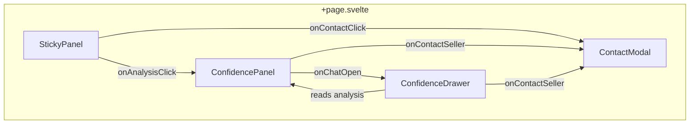

# Slices 6-7 Frontend: Chat Drawer + Contact Modal

This document is the frontend/UI spec for the Slice 6 (Contact Seller Modal + Session Save) and Slice 7 (Listing Q&A) surfaces. It supersedes the inline-chat approach described in `slice-5-7-frontend-spec.md` with a side-drawer model.

The complementary backend contract for Slice 7 lives in `docs/slice-7-chat-backend-spec.md`.

## Design rationale

The assessment panel is a **read-only research artifact**. The conversation is a **separate interactive layer** that opens alongside it. This avoids nested scroll, panel bloat, and noise in the analysis.

---

## Architecture

**Component ownership:**

- `ConfidencePanel` -- assessment rendering and confidence data ownership (existing, add chat CTA button)
- `ConfidenceDrawer` -- right-side drawer shell with chat thread inside
- `ContactModal` -- seller outreach modal (shadcn Dialog)
- `StickyPanel` -- adapts CTA based on analysis state
- `+page.svelte` -- owns drawer/modal open-close state, current listing-level session state, and wiring between components

**State ownership contract:**

- `ConfidencePanel` owns fetching `/api/confidence/[id]`, local confidence loading/error state, and the latest `analysis` payload.
- `ConfidencePanel` emits the current `analysis` upward after load so `+page.svelte` can pass it to `StickyPanel`, `ConfidenceDrawer`, and `ContactModal`.
- `+page.svelte` owns `analysisReady`, `isDrawerOpen`, `isContactModalOpen`, and per-listing session chat state.
- `ConfidenceDrawer` does not fetch confidence data on its own. It receives listing summary, analysis snapshot, original `q`, and chat state from the page.

---

## Desktop: side drawer

- `position: fixed; right: 0; top: 0; height: 100vh; width: 440px`
- Slides in from the right with a smooth translate transition
- Semi-transparent backdrop behind it (click-to-close)
- The assessment panel and listing content remain fully visible on the left
- The StickyPanel (right column, `sticky top-24`) gets covered by the drawer, which is fine -- the user is now in research mode, not summary mode

## Mobile: full-screen sheet

- `position: fixed; inset: 0` -- takes the full viewport
- Slides up from the bottom
- Header includes a compact assessment reference bar: verdict badge + issue count + question count in a single row. Tapping it does nothing (the full analysis is one "close" away)
- Input composer sits at the bottom, above safe area
- No competing scroll containers -- the sheet owns the entire screen

---

## Chat styling (Cursor-inspired)

- **User messages**: subtle `bg-secondary` rounded container, left-aligned. Small "You" label above. Compact, not a full chat bubble.
- **AI responses**: no container, no bubble, no background. Text flows directly on the drawer's background using the same typography as the assessment sections (`text-[0.84rem] leading-[1.65] text-[var(--color-text-secondary)]`). May include formatted lists or bold emphasis. Visually reads like an additional research paragraph, not a chatbot reply.
- **No avatars, no timestamps** in the thread. Clean editorial feel.
- **Starter prompts**: shown when chat is empty. 2-3 contextual suggestions based on the analysis (e.g., "Is the salvage title a dealbreaker?", "What should I negotiate on?"). Rendered as tappable chips.

---

## Chat entry point

A single **"Ask about this listing"** button at the bottom of the assessment sections in `ConfidencePanel`, below the "Questions to Ask" section. Uses `MessageCircleQuestion` icon + label.

Future enhancement: per-section contextual buttons that pre-seed the conversation topic. The architecture supports this by passing an optional `initialPrompt` into the drawer.

---

## Contact Modal (Slice 6)

- Built with existing `src/lib/components/ui/dialog/*` (shadcn Dialog)
- Pre-populated with AI-generated seller questions from `analysis.questionsToAsk`
- Editable message body -- user can add/remove/reorder questions
- Fallback template if analysis is unavailable (generic "I'm interested in this listing" message)
- Optional: if a chat conversation exists, include a `relevantChatSummary` for context
- Slice 6 scope is drafting UX only. No outbound send backend is required in this slice.
- Triggered from:
  1. Action row button in ConfidencePanel (after assessment loads)
  2. CTA in StickyPanel (once analysis is ready)
  3. Optional link in the chat drawer

### Session save store

`src/lib/stores/saved.ts` -- session-only `$state` store for saved listing IDs. Simple `Set<string>` wrapped in a reactive store. No persistence beyond the browser tab.

---

## StickyPanel evolution

- **Before analysis**: "See full analysis" CTA (current behavior)
- **After analysis loads**: the CTA text updates to "Contact seller" (or a second button appears alongside)
- **Mobile bottom bar**: same adaptive behavior. Once analysis is loaded, the primary mobile CTA becomes "Contact seller" since the analysis is already expanded above

---

## State machines (all independent)

### Assessment
`idle` -> `loading` -> `ready` | `error`

### Drawer
`closed` | `open`

### Chat
`chatIdle` -> `chatComposing` -> `chatSending` -> `chatReady` | `chatError`

### Contact
`closed` -> `open` -> `prefilled` -> `editing` -> `readyToSend` | `fallback`

**Failure isolation**: a chat error never clears the assessment. An assessment error never blocks the contact modal (falls back to template). Closing the drawer preserves chat history for the session.

### Session persistence contract

- Chat history is session-only and keyed by listing ID.
- Navigating away from and back to the same listing within the current app session should preserve the thread if the page-level store is still alive.
- Refreshing the browser clears the thread.
- Draft text in the composer should survive retry states, but does not need to survive a full page refresh.

---

## Route and query propagation

This is the query flow the frontend must preserve:

1. Homepage chips or search submit navigate to `/vehicles?q=...`.
2. Results page links to a listing detail route while preserving `q`.
3. Detail page reads `q` from the current URL.
4. `ConfidencePanel` passes `q` into `/api/confidence/[id]`.
5. `ConfidenceDrawer` passes `q` into `/api/confidence-chat/[id]`.
6. Back-to-results navigation preserves `q` when present.

Rules:

- Query intent is optional context, not a required dependency.
- If the user arrived directly on a listing, assessment and chat still work.
- If `q` is present, use it as lightweight buyer-intent context, not as the sole source of truth.

---

## Accessibility

- Drawer open, drawer close, contact modal open, send, and retry actions must all be keyboard reachable.
- The drawer must trap focus while open and restore focus to the triggering control when closed.
- The mobile full-screen sheet should use the same semantic dialog treatment as the desktop drawer overlay.
- Chat input, retry, and contact buttons need clear visible focus states.
- Use semantic headings for the three assessment sections.
- Keep labels explicit; avoid icon-only controls for primary actions.

---

## File changes

### New files
- `src/lib/components/ConfidenceDrawer.svelte` -- drawer shell (fixed positioning, backdrop, slide animation, responsive breakpoint logic) + chat thread (starter prompts, message list, input composer, send/retry)
- `src/lib/components/ContactModal.svelte` -- shadcn Dialog with prefilled questions, editable body, send CTA
- `src/lib/stores/saved.ts` -- session-only saved listings store

### Modified files
- `src/lib/components/ConfidencePanel.svelte` -- add "Ask about this listing" CTA button after Questions section + "Contact seller" action row + emit `analysisLoaded`, `onChatOpen`, and `onContactSeller` callbacks
- `src/lib/components/StickyPanel.svelte` -- accept `analysisReady` prop, show adaptive CTA (analysis vs contact), accept `onContactSellerClick` callback
- `src/routes/vehicles/[id]/+page.svelte` -- wire drawer open/close state, contact modal state, pass analysis data between components, manage `analysisReady` flag

---

## Spec deviation note

The original frontend spec (`slice-5-7-frontend-spec.md`) says "Follow-up Q&A belongs inside the same panel surface as the assessment." This spec deliberately moves Q&A to an adjacent drawer surface. The justification: bounded scroll inside an expandable panel inside a scrollable page creates hostile nested-scroll UX, especially on mobile. The drawer keeps Q&A visually connected to the assessment (visible alongside on desktop, compact reference on mobile) while giving the conversation proper space.
